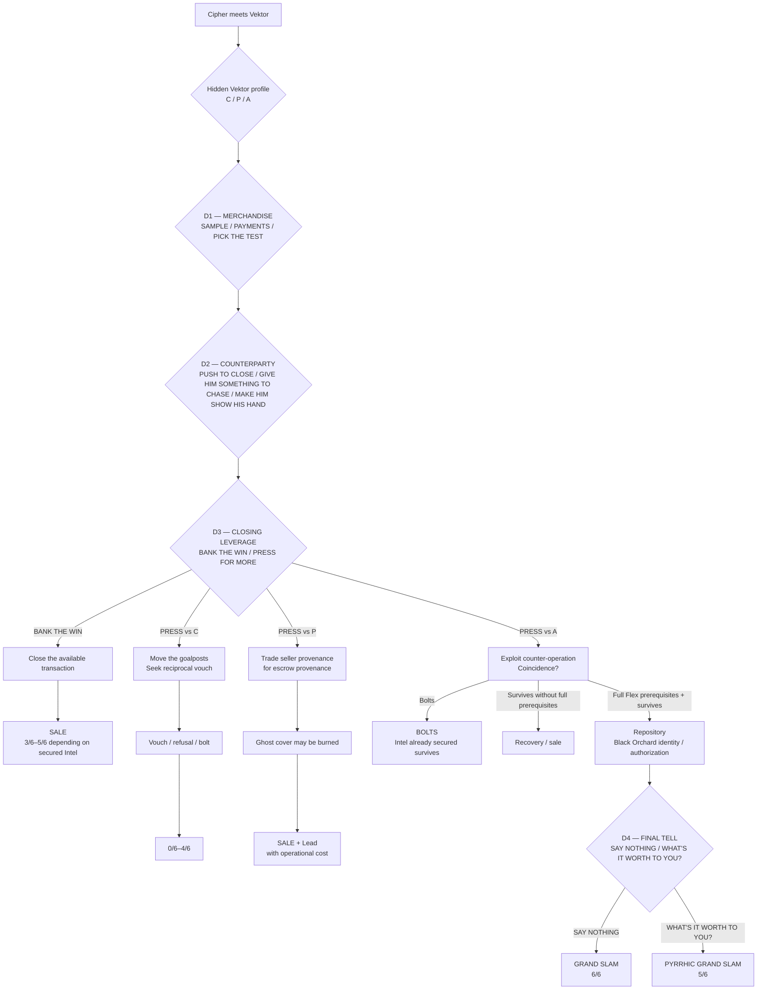
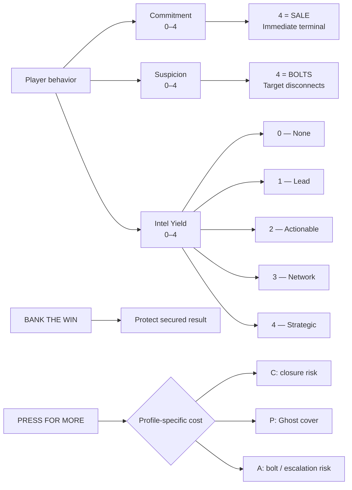

# THE TELL

**Format:** Interactive branching narrative (Ink)  
**Target playtime:** ~5 minutes  
**Build:** `The_Tell.ink`

## Design Objective

**The Tell** is a short Technical Narrative Design portfolio sample built to demonstrate three disciplines in the same playable scene:

- **character writing** — terse, high-pressure negotiation driven by conflicting objectives;
- **narrative systems design** — hidden NPC behavior, remembered state, risk/reward decisions, and consequential branching;
- **technical implementation** — readable Ink architecture grounded in database, security, and investigative mechanics.

The technical material is not intended as jargon decoration. It changes what the characters can verify, what the player can risk, and what the operation can learn.

## Premise

You play **Cipher**, an undercover seller in an FBI-controlled data-market sting.

The buyer, **Vektor**, has already seen enough of the merchandise to be interested. What he does **not** know is whether Cipher is a legitimate criminal seller, an amateur with a stolen snapshot, or law enforcement.

Cipher's job is not simply to close the sale.

He is trying to learn from the way Vektor verifies him.

> **As Vektor detects, he reveals.**

The operation therefore has two competing objectives:

1. secure the transaction;
2. exploit Vektor's verification behavior for intelligence without pushing him far enough to bolt.

The title refers to the same question on both sides of the negotiation:

> **What does your behavior tell me that you did not intend to tell me?**

By the final branch, that question also applies to the player.

## Play

Open `The_Tell.ink` in **Inky** and play from the beginning.

The release build does **not** expose Vektor's internal profile or the underlying state values.

A separate QA build may force hidden profile/RNG for regression testing, but the portfolio build intentionally does not.

## Decision Architecture

The game is designed around **three major decisions**, with a rare fourth decision on the deepest escalation path.

### D1 — Merchandise

**What proof will Cipher expose?**

Player-facing choices:

- `SAMPLE`
- `PAYMENTS`
- `PICK THE TEST`

D1 establishes the first behavioral history. Different choices can create different verification surfaces, intelligence opportunities, or future risk.

### D2 — Counterparty

**How will Cipher handle Vektor's attempt to vet the seller?**

Player-facing choices:

- `PUSH TO CLOSE`
- `GIVE HIM SOMETHING TO CHASE`
- `MAKE HIM SHOW HIS HAND`

The same player action can produce different dialogue and consequences because Vektor's hidden behavior profile is fixed for the playthrough.

### D3 — Closing Leverage

At this point the transaction is available.

The player must decide whether to preserve the secured result or spend additional risk budget:

- `BANK THE WIN`
- `PRESS FOR MORE`

The cost of pressing is profile-specific:

- **C / Closure:** pressing adds friction after agreement and can blow the sale;
- **P / Professional:** pressing can buy buyer-side provenance, but spends Ghost's mature cover;
- **A / Aggressive:** pressing turns his counter-operation back on him and can expose higher-value network intelligence—or cause him to bolt.

### Exceptional D4 — The Final Tell

Only the deepest A/Flex escalation can reach the final choice:

- `SAY NOTHING`
- `WHAT'S IT WORTH TO YOU?`

At that point there is no higher Intel tier left to gain.

The final decision tests restraint.

## Hidden Vektor Profiles

Vektor is one character with one objective, but one behavioral profile is selected at the start of each playthrough and remains hidden.

### C — Closure

Wants enough proof to transact with minimum friction.

His Tell is his desire to finish.

### P — Professional

Wants provenance, attribution, boundaries, and insulation.

His Tell is the shape of the disclosure boundary he insists on protecting.

### A — Aggressive

Uses bluster, motivated inference, and control pressure.

His Tell is that his effort to dominate verification can expose how he counter-operates.

The profiles are not difficulty modes and are not presented to the player as classes. The player learns who is sitting across from Cipher by observing behavior.

## Narrative Architecture



## State / Risk Architecture

The player never sees raw state numbers during play.



### Important implementation rule

`Commitment == 4` means the sale is complete.

There is no artificial "one more move" after a successful transaction merely to create additional gameplay.

Likewise, Intel already secured by an earlier action persists even if the player later chooses a conservative close.

## Outcome Scale

The score reflects **overall operational performance**. The narrative label explains what actually happened.

| Score | Outcome |
|---:|---|
| **0/6** | Vektor bolts; no Intel secured |
| **1/6** | Vektor bolts; Lead secured |
| **2/6** | Vektor bolts; Actionable Intel secured |
| **3/6** | Sale |
| **4/6** | Sale + Lead |
| **5/6** | Sale + Actionable Intel **or** Pyrrhic Grand Slam |
| **6/6** | Grand Slam |

The scale was not populated top-down. The outcomes emerged from reachable game states during branch certification.

## Technical Narrative Layer

The technical mechanics exist to create dramatic decisions.

Examples include:

- masking session metadata such as `MACHINE` and `OSUSER` so proof of data access does not casually expose Cipher's access path;
- using payment/feed timing and processing latency as a freshness-verification problem;
- controlled sensitive-record disclosure when Vektor chooses his own test;
- a monitored verification surface that can turn Vektor's checking behavior into an investigative Lead;
- **Surface X**, a fictional underground commercial venue used as part of the relationship/verification environment;
- **Candyman**, the human fixer/bridge whose relationship graph becomes relevant to Vektor's counter-probe;
- a durable cryptographic identity associated with **Black Orchard**;
- a separate fresh authorization event capable of demonstrating live network authority rather than merely possession of an old credential.

The design deliberately avoids treating IP addresses, fingerprints, or cryptographic artifacts as magical identity proof. Correlation creates investigative value; it does not automatically reveal a person.

## Narrative-System Principles

A few rules governed the implementation:

- **Every state change requires a causal event in the scene.**
- **Vektor is allowed to be right.**
- **Vance is allowed to be right.**
- **Successful risk-taking is not automatically good play.**
- **Tactical / Strategic / Flex are design trajectories, not player-facing classes.**
- **Technical authenticity must affect gameplay rather than decorate dialogue.**
- **The player should read people and risk, not hidden numbers.**
- **No branch exists merely to make the graph look larger.**

The resulting risk frontier is intentionally asymmetric:

- safer play protects the transaction;
- controlled play can produce efficient intelligence;
- Flex accepts variance for access to outcomes safer play cannot reach.

## Ink Implementation

The release file uses:

- constants for profile / strategy identities;
- persistent state variables;
- knots and conditional routing;
- hidden profile selection;
- selective RNG only at interpretive moments;
- remembered D1/D2 history;
- foldback branching where histories can legitimately converge;
- profile-specific D3 consequences;
- terminal scoring based on secured operational state.

Key variables include:

```ink
VAR vektor_profile = PROFILE_C

VAR d1_strategy = -1
VAR d2_strategy = -1

VAR commitment = 0
VAR suspicion = 0
VAR intel = 0

VAR pressure_signature = false
VAR counter_probe_captured = false
VAR ghost_cover_compromised = false

VAR grand_slam_possible = true
VAR grand_slam_secured = false
```

The code also contains reviewer-facing comments explaining non-obvious design decisions, including why the employer build does not bias the hidden profile toward the rare Grand Slam route.

## Validation

The current version state machine has passed:

- **clean Inky compilation**;
- **8/8 targeted runtime smoke tests** across C/P/A;
- **54-family deterministic full-path certification**;
- **2,000,000-playthrough Monte Carlo stress test**;
- verified reachability of every score from **0/6 through 6/6**;
- no missing divert targets or impossible Grand Slam routes in the certified graph.

The Monte Carlo pass is a stress test of the state machine, not a prediction of player behavior.

## Repository Files

Recommended portfolio package:

- `The_Tell.ink` — employer-facing playable Ink source;
- `README.md` — project overview and architecture diagrams;
- `DEV_NOTES.md` — deeper design rationale for code reviewers;
- `QA/The_Tell_QA.ink` — deterministic regression build;
- `QA/QA_Guide.md` — targeted runtime test procedure;
- `QA/exact_full-path_ceritifcation.csv` — certified path/outcome reference.

Historical **Data Guard Sting** files are earlier prototypes and are not revision ancestors of the current page-one rewrite.

## Portfolio Intent

The sample is deliberately small.

The goal is not to demonstrate maximum branch count. It is to show that dialogue, technical knowledge, NPC behavior, player choice, state, risk, and implementation can all describe the **same dramatic problem**.

A reviewer should be able to:

1. play the scene in roughly five minutes;
2. inspect the Mermaid diagrams and understand the architecture;
3. open the Ink and see that the implementation corresponds to the design;
4. follow the comments / developer notes and understand why the unusual risk structure is intentional.

That is the artifact.
