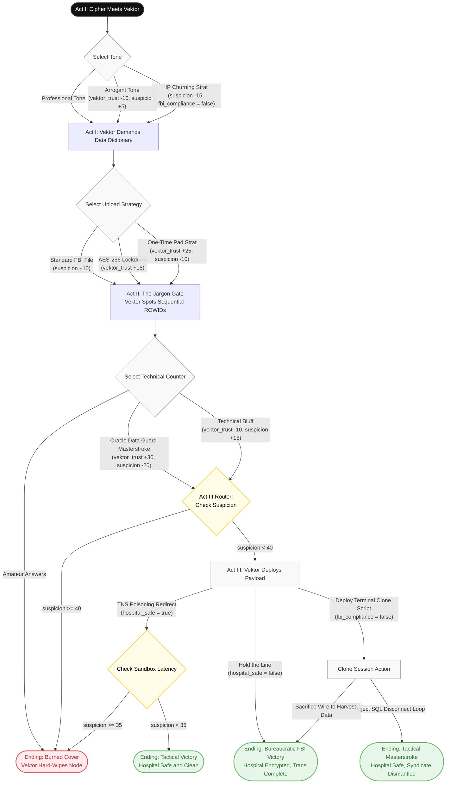

# THE DATA GUARD STING
**Format:** Interactive Branching Text Demo (Ink Architecture)  
**Playtime:** ~5 Minutes  

## Design Objective
To demonstrate high-tension, fast-paced character dialogue driven by authentic relational database engineering principles (Oracle Data Guard architectures and network routing constraints). This project bridges advanced software engineering with elite screenplay pacing.

## Core State Variables Tracked
* `vektor_trust`: Controls character volatility, pacing, and transaction delays.
* `suspicion`: Controls automated network counter-traces and gatekeeper tripwires.
* `fbi_compliance`: Tracks operational ethics vs. rogue undercover survival tactics.
* `hospital_safe`: Tracks the physical security and integrity of the St. Jude database framework.

## Golden Path Reference
To achieve the optimal 'Tactical Masterstroke' outcome, the user must execute a high-risk technical strategy:
1. **Act I (The Setup):** Blind the automated AI scraper using the **IP Churning Strat** (Sets up low suspicion).
2. **Act I (The Ask):** Establish commercial leverage by uploading an **OTP-obfuscated** structural data block.
3. **Act II (The Jargon Gate):** Bypass Vektor's data integrity trap cleanly via the **Oracle Data Guard DR failover** masterstroke response.
4. **Act III (The Climax):** Deploy the **Terminal Emulator Clone Script** to actively capture Vektor's session IDs.
5. **Act III (The Resolution):** Force an immediate, administrative `ALTER SYSTEM DISCONNECT SESSION` statement back up the pipe to kill his connection before encryption executes.

## Project Architecture Flowchart
This diagram renders automatically into a clean geometric flowchart inside compatible viewers like GitHub, Notion, or Obsidian.

